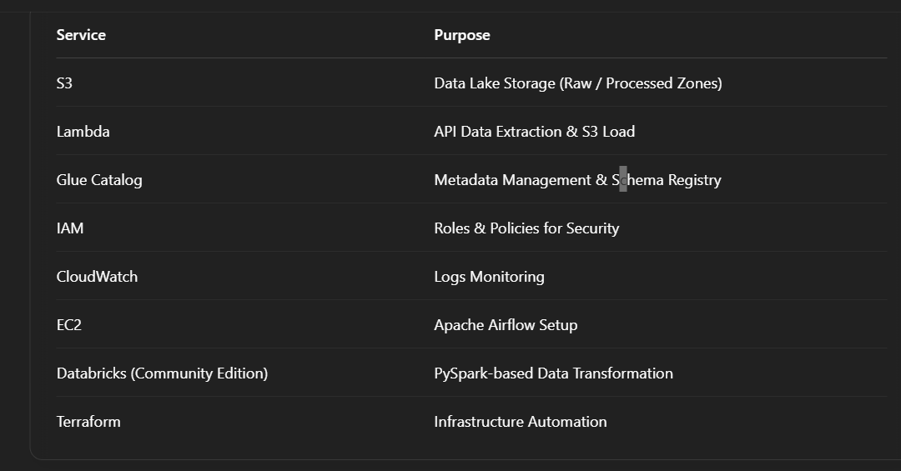

# AWS Data Engg Project

Design like Enterprise Architect
Execute like a Student on Free Tier

## Project Overview
This project demonstrates a real-time Data Engineering pipeline built using AWS Cloud services, Terraform for Infrastructure as Code (IaC), and Databricks for data processing.

We are extracting E-commerce data from DummyJSON API and storing it in an S3 Data Lake. The pipeline processes and transforms the data using AWS Lambda and Databricks Spark and is orchestrated using Apache Airflow.

## Architecture Diagram

DummyJSON API (E-Commerce Data)
  ↓
AWS Lambda (Fetch & Store Raw Data)
   ↓
S3 Bucket (Raw Zone)
  ↓
Glue Data Catalog (Metadata)
  ↓
Airflow (Orchestration - Running on EC2)
   ↓
Databricks Community Edition (Spark Transformation)
   ↓
S3 Bucket (Processed Zone)

## AWS Services Used

aws-data-engg-project/
│
├── terraform/        --> AWS Infra Automation Code
├── lambda/           --> Python Lambda Function to Fetch API Data
├── airflow/          --> Apache Airflow DAGs
├── databricks/       --> Spark Notebooks for Data Transformation
├── data/             --> Input & Output Files
├── README.md         --> This File
└── architecture-diagram.png  --> Architecture Diagram

# How to Run This Project

### 1. Clone Repo

git clone https://github.com/yourusername/aws-data-engg-project.git
cd aws-data-engg-project

### 2. Setup Terraform

cd terraform/
terraform init
terraform plan
terraform apply

### 3. Lambda Function

1.Navigate to lambda/
2.Modify lambda_function.py to fetch API data
3.Deploy using Terraform

### 4. Airflow

Setup EC2 Instance (t2.micro Free Tier)

Install Airflow

Place etl_pipeline_dag.py under Airflow's dags/ folder

Trigger DAG to orchestrate Lambda & Databricks flow

### 5. Databricks
Signup for Databricks Community Edition

Upload transform_data.py as a Notebook

Process Data and Write to S3 (Processed Zone)

### Final Output
Raw Data in S3 (s3://your-bucket/raw/)

Transformed Data in S3 (s3://your-bucket/processed/)

Notes:
This project is completely designed to work within AWS Free Tier limits.
Please ensure to stop EC2 instance and clean up AWS resources post-usage using:

bash
Copy
Edit
terraform destroy
Credits
DummyJSON for Sample API Data

AWS Free Tier Services

Databricks Community Edition

Day to Day Progress
Day1 14/4/2025
