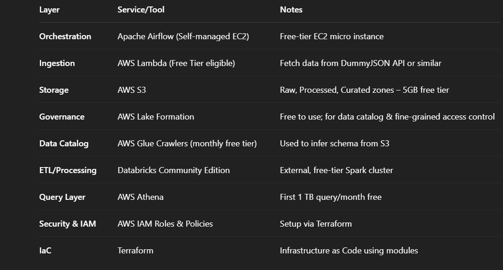

# Ecommerce Analytics Platform on AWS using Terraform

Design like Enterprise Architect
Execute like a Student on Free Tier

## Project Overview

This project showcases a cost-effective, production-style data lake architecture using only AWS Free Tier eligible services. The use case focuses on ingesting and processing product data from public APIs and enabling analytics using serverless querying.

-> Lambda (triggered manually or scheduled) fetches product data from DummyJSON API.

-> Data is stored in S3 (raw zone).

-> Glue Crawlers scan and catalog this data into the AWS Glue Data Catalog.

-> Databricks Community Edition reads raw data from S3, processes and writes cleaned output back to the  processed/curated zones.

-> Lake Formation manages access permissions for Athena, Glue, and users.

-> Athena queries data in S3 (via Glue Catalog) for ad-hoc or dashboard analysis.

-> Apache Airflow (on EC2) orchestrates the entire flow via DAGs.(qube flow, Informatica)

## Architecture Components

### 2. Setup Terraform

cd terraform/
terraform init
terraform plan
terraform apply

### 3. Lambda Function

1.Navigate to lambda/
2.Modify lambda_function.py to fetch API data
3.Deploy using Terraform

### 4. Airflow

Setup EC2 Instance (t2.micro Free Tier)

Install Airflow

Place etl_pipeline_dag.py under Airflow's dags/ folder

Trigger DAG to orchestrate Lambda & Databricks flow

### 5. Databricks
Signup for Databricks Community Edition

Upload transform_data.py as a Notebook

Process Data and Write to S3 (Processed Zone)

### Final Output
Raw Data in S3 (s3://your-bucket/raw/)

Transformed Data in S3 (s3://your-bucket/processed/)

Notes:
This project is completely designed to work within AWS Free Tier limits.
Please ensure to stop EC2 instance and clean up AWS resources post-usage using:

bash
Copy
Edit
terraform destroy
Credits
DummyJSON for Sample API Data

AWS Free Tier Services

Databricks Community Edition

Day to Day Progress
Day1 14/4/2025
